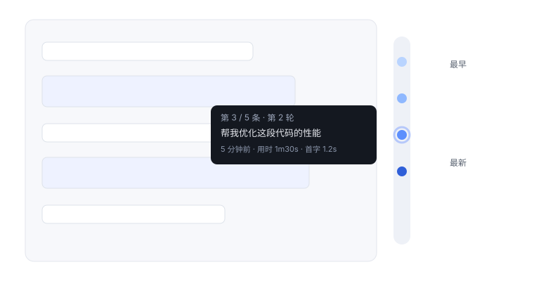

<div align="center">


# dsh-milestone

**DeepSeek Harness 的会话里程碑导航条**

像 Git 提交图一样，一眼定位每一次提问，一键跳转到任何位置。

<p>
  <a href="https://www.npmjs.com/package/dsh-milestone"></a>
  <a href="https://www.npmjs.com/package/dsh-milestone"></a>
  <a href="./LICENSE"></a>
  <a href="https://github.com/topics/dsh-plugin"></a>
</p>

</div>

---

## 为什么需要它？

- 上百轮对话之后，想找回「第 17 轮那个提问」？只能不停往上翻，在代码块和思考过程里大海捞针。
- 右侧挂一条**圆点时间线**：一个提问一个圆点，悬停看内容，点击瞬间跳转——长对话的「导航地图」。
- 官方 slot 机制挂载，不修改 harness 源码，装完即用。



## 快速开始

```sh
# 从 npm 安装（推荐）
dsh plugin --profile demo add dsh-milestone

# 或从 GitHub 源码安装
dsh plugin --profile demo add "github:SnowCrescenter-tech/dsh-milestone#main"

# 启动 Web UI
npx @deepseek-ai/dsh web    # → http://127.0.0.1:3080
```

打开一个**多轮对话**（至少 2 条提问），会话视图右侧就会出现里程碑条。

> 要求 Node.js `>= 24`（harness 官方要求）。

## 功能总览

按类别分组，一屏扫完所有能力。

| 类别 | 功能 · 一句话 | 键位 |
| --- | --- | --- |
| 定位导航 | 圆点时间线：每问一个圆点，点击平滑跳转 | |
| 定位导航 | 当前位置高亮：视口最近的提问亮起白环 | |
| 定位导航 | 加载更早：「···」继续加载历史，提示已显示条数 | |
| 定位导航 | 全部提问列表：序号 + 轮次 + 预览一次看全，点击直达 | |
| 定位导航 | 深链接：`#msg=` 锚点，刷新/分享后直达同一条 | |
| 搜索过滤 | 站内搜索：匹配完整消息内容，实时 N/M 命中 | Enter 下一个 / Esc 清空 |
| 搜索过滤 | 跨会话搜索：搜所有会话，点击打开对应会话 | |
| 搜索过滤 | 收藏书签：悬停点星，★ 只看收藏 | |
| 状态感知 | 轮次健康徽章：出错红 / 上限黄 / 重试橙 / 运行蓝 / 等待脉冲 | |
| 状态感知 | 悬停元信息：时间 · 轮次 · 用时 · 结束原因 · TTFT · tok/s · 模型 · token 用量 | |
| 个性化与效率 | 键盘导航：全程不用鼠标 | ↑↓ 移动 · Enter 跳转 · Home/End 首尾 |
| 个性化与效率 | turn 分组折叠：按轮次成组，长轮次折成一条 | |
| 个性化与效率 | 复制与 fork：一键复制提问全文 / 从此处分支 | |
| 个性化与效率 | 聚焦模式：淡化 thinking 区块，悬停或展开恢复 | |
| 个性化与效率 | 折叠工具栏：功能键默认收起，箭头展开；设置菜单可把常用键钉到折叠外（持久化 + 恢复默认） | |
| 个性化与效率 | 中英双语：跟随 harness 界面语言 | |
| 个性化与效率 | 点击外部关闭：搜索 / 列表等浮层自动收起 | |
| 发布运维 | 更新检测：6h 缓存自动检查，新版徽章，一键去 npm | |
| 发布运维 | 设置推广区：GitHub / Star / Issue / npm 四入口 | |

另：滚轮可在里程碑条上直接滑动选点；圆点的固定间距与蓝色渐变见下方「圆点时间线」一节。

## 核心功能详解

### 圆点时间线与悬停元信息

- 每个提问一个圆点，点击平滑跳转；悬停即看内容与元信息。
- 圆点等距排列、不随对话长度变形；颜色由浅入深标出先后，同 Git 提交图。

```
┌──────────────────────────────────────────┐
│ 第 3 / 5 条 · 第 2 轮         ☆ 复制 ✂    │  ← 序号 + 轮次 + 收藏/复制/fork
│ 帮我优化这段代码的性能                     │  ← 消息预览（前 80 字）
│ 5 分钟前 · 用时 1m30s · 首字 1.2s · 12.4 tok/s │  ← 时间 · 耗时 · TTFT · 吞吐
│ v4 · continue · 1280 / 2560 tok           │  ← 模型 · 用途 · token 用量
└──────────────────────────────────────────┘
```

元信息全部来自 harness 原生 session 快照（`turnTimings` / `timeline.turns` / `turn-tail`），无额外依赖。

### 站内搜索

- 搜索框过滤圆点，匹配的是**完整消息内容**（不是 80 字摘要），实时显示命中数 N/M。
- `Enter` 跳到下一个匹配，`Esc` 一键清空。
- 范围 = 当前已加载窗口；更早的历史先点「···」加载进来。

### 收藏书签

- 悬停圆点点星收藏，刷新后仍在（`store.persist`，按会话隔离）。
- 顶部「★」一键只看收藏，把一次性跳转变反复回访。

### 深链接 `#msg=`

- 跳转时 URL 带上 `#msg=`，刷新或分享链接后仍回到同一条消息。
- 目标在已加载窗口外时，自动先加载更早历史再定位（受加载上限约束）。

### 跨会话搜索

- 一键搜索**所有会话**的消息内容（harness 原生索引）。
- 点击结果直接打开对应会话；最多 20 条结果，片段 ≤240 字符。

### 更新检测

- 自动检查 npm 新版本，6 小时缓存，不打扰。
- 发现新版：功能键亮起提醒徽章；弹窗展示当前/最新版本与**已适配版本线**；一键去 npm 升级。

## 工作原理

双半边浏览器插件（空 node half + `shell.overlay` slot 挂载的 client half），零侵入：

```
shell.overlay (root scope)
  └─ milestone.rail (session scope, 自声明子槽)
       └─ useSession 读取会话快照 → 圆点列表 + 悬停 + 跳转
```

- **注入点**：`shell.overlay` 全框架浮动层，附加式、点击穿透，不碰现有 UI。
- **数据源**：`chat.order` + `chat.nodes`（user 消息与 `turn-error`/`turn-max-tokens`/`model-retry` 节点）+ `chat.timeline`（turn 元数据）+ `hasMore`/`loadingOlder`（分页）+ `running`/`pending`（徽章）+ `loadOlder`（inject face）。
- **跳转**：DOM 锚点 `data-chat-anchor-key`，`scrollIntoView` 平滑定位。
- **持久化**：`store.persist`（每会话 localStorage，key `dsh-milestone.bookmarks.<sessionId>`），经 `defineStore` 引擎读写；工具栏偏好同理。
- **纯函数分层**：搜索过滤 / 位置计算 / 圆点状态都在 `rail-logic.ts` 纯函数里，单测覆盖。

## 版本与兼容

- 当前官方支持线：**`0.1.1-rc.2`**（peer/dev 依赖 `^0.1.1-rc.2`，与 `@deepseek-ai/dsh` 最新 `latest` 标签一致）。
- 官方客户端包（`dsh-client-runtime` 等）在 npm 上走 `next` 标签发布（`latest` 标签仍是远古版本）；升级 harness 后若发现插件不匹配，请确认安装的依赖解析到了 `0.1.1-rc.2` 线。
- 更新检测弹窗内展示本插件声明支持的版本线；harness 当前版本在浏览器端没有可信来源（`host.describe().version` 是占位值），因此不做精确探测，以声明线为准。

## 已知限制

> ⚠️ **最需要注意**：搜索只覆盖**当前已加载**的消息窗口（初始 50 条）——更早的历史需先点顶部「···」加载进来，才能被搜到。

<details>
<summary>查看更多已知限制（点击展开）</summary>

- TTFT / tokens/秒 依赖 turn 位置数据，窗口外或未完成的 turn 不显示（自动隐藏）。
- 徽章的瞬态状态（运行中/等待输入）只点亮**最新一条可见提问**——若该轮次的提问在窗口外，则无脉冲。
- 书签按**会话**隔离（不跨会话共享）。
- 模型 / token 用量依赖该轮 assistant 节点的元数据，部分场景下缺失则自动隐藏该行。
- fork 从选中消息所在轮次开始分支，不会自动打开子会话（需在会话列表手动打开）。
- 深链接的目标消息若早于已加载窗口，会先自动加载更早历史再定位（受加载上限约束，极端深的历史可能定位失败）。
- 跨会话搜索依赖 harness 的消息内容索引（`session.search`），仅返回片段（≤240 字符）、最多 20 条结果；命中过多时请细化关键词。
- 聚焦模式作用于当前会话视图的思考区块，不影响其他插件或工具的展示。
- 尚无全局快捷键聚焦里程碑条（需 Tab 键切换到）。
- 功能键**默认折叠**，首次使用需点箭头展开；可在设置菜单里把常用键钉到折叠外。
- 更新检测依赖浏览器能访问 npm 镜像（`registry.npmmirror.com` / `registry.npmjs.org`）；若页面 CSP 限制 `connect-src` 或离线，检查会静默失败。结果缓存 6 小时。
- 工具栏固定偏好存于浏览器 localStorage（不跨浏览器/设备同步）。

</details>

## 更新日志

<details>
<summary>v0.6.1 / v0.6.0（点击展开）</summary>

**v0.6.1** · 对齐 `0.1.1-rc.2` 支持线 · 五项新功能 · 292 项测试

- 折叠工具栏：功能键默认收起，箭头展开。
- 设置菜单：常用功能「在折叠外显示」固定自定义；偏好持久化，一键恢复默认。
- 设置底部推广区：GitHub / Star / Issue / npm 四入口。
- 更新检测：6h 缓存自动检查、新版徽章、当前/最新版本与已适配版本线、一键去 npm。
- 点击外部自动关闭各浮层（与官方 capture 阶段 pointerdown 契约一致）。

> [GitHub Release v0.6.1](https://github.com/SnowCrescenter-tech/dsh-milestone/releases/tag/v0.6.1)

**v0.6.0** · P3 功能

- 聚焦模式：淡化思考(thinking)区块，悬停或展开自动恢复。
- 全部提问列表面板：序号 + 轮次 + 预览一次看全，点击即跳。
- 深链接：`#msg=` 锚点，刷新或分享后直达同一条消息。
- 跨会话搜索：搜索所有会话的消息内容，点击结果打开对应会话。

> [GitHub Release v0.6.0](https://github.com/SnowCrescenter-tech/dsh-milestone/releases/tag/v0.6.0)

</details>

维护者：发布清单见 [RELEASING.md](./RELEASING.md)。

## License

[MIT](./LICENSE)

---

<p align="center">
  觉得好用？给个 star 支持一下，或把它推荐给正在 DeepSeek Harness 里挣扎的开发者吧。
</p>